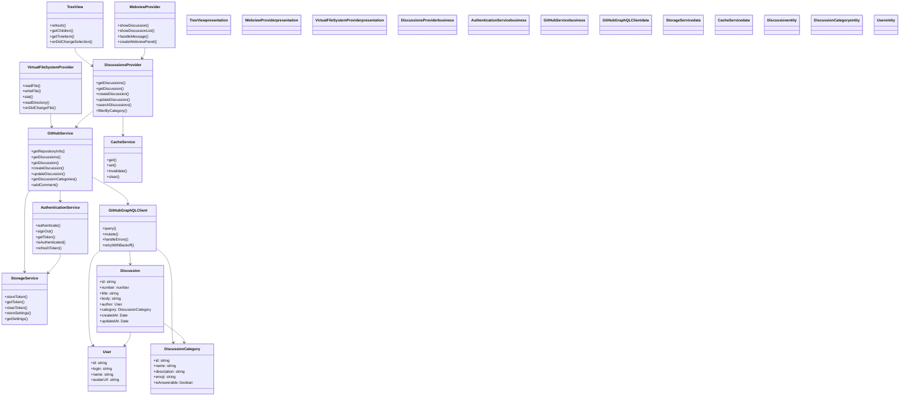
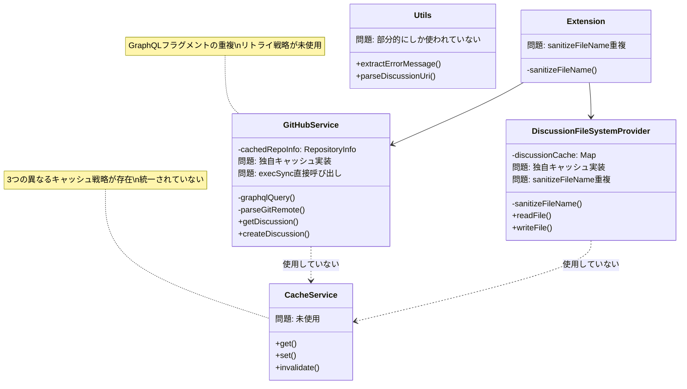

# 設計文書

## 概要

VSCode上でGitHub Discussionsを効率的に管理できる拡張機能の設計。この拡張機能は、開発者がIDEを離れることなくDiscussionsの閲覧、作成、編集を行えるようにする。特に、VSCodeのFileSystemProviderを活用して、Discussionsを通常のマークダウンファイルとして編集できる革新的なアプローチを採用する。

## アーキテクチャ

### 全体構成



### レイヤー構成

1. **プレゼンテーション層**
   - Tree View: Discussions一覧表示
   - Webview: Discussion詳細表示
   - Virtual File System: マークダウンエディタ

2. **ビジネスロジック層**
   - Authentication Service: GitHub認証管理
   - GitHub Service: API通信
   - Discussions Provider: データ管理

3. **データアクセス層**
   - GitHub GraphQL API: Discussionsデータ
   - VSCode Storage: 認証情報・設定

## コンポーネントとインターフェース

### 1. Authentication Service

```typescript
interface AuthenticationService {
  getSession(): Promise<vscode.AuthenticationSession | undefined>;
  isAuthenticated(): Promise<boolean>;
  getCurrentUser(): Promise<User | undefined>;
  onDidChangeAuthenticationState: vscode.Event<AuthenticationState>;
}
```

**責務:**
- VSCode組み込みGitHub認証プロバイダーとの連携
- 認証セッションの取得と管理
- 認証状態の監視と通知

### 2. GitHub Service

```typescript
interface GitHubService {
  getRepositoryInfo(): Promise<RepositoryInfo>;
  getDiscussionSummaries(options: DiscussionQueryOptions): Promise<DiscussionSummary[]>;  // メタデータのみ（一覧用）
  getDiscussion(number: number): Promise<Discussion>;  // 詳細取得（本文・コメント含む）
  getDiscussionComments(discussionNumber: number, after?: string): Promise<CommentsPage>;  // ページング対応コメント取得
  createDiscussion(input: CreateDiscussionInput): Promise<Discussion>;
  updateDiscussion(id: string, input: UpdateDiscussionInput): Promise<Discussion>;
  getDiscussionCategories(): Promise<DiscussionCategory[]>;
  addComment(discussionId: string, body: string): Promise<void>;
  addReply(commentId: string, body: string): Promise<void>;  // コメントへのリプライ
  updateComment(commentId: string, body: string): Promise<void>;  // コメントの編集（要件13.3）
  deleteComment(commentId: string): Promise<void>;  // コメントの削除（要件13.6）
  getMentionableUsers(discussionNumber?: number): Promise<MentionableUser[]>;  // メンション候補取得（要件19）
}

interface CommentsPage {
  comments: DiscussionComment[];
  pageInfo: {
    hasNextPage: boolean;
    endCursor: string | null;
  };
}
```

**責務:**
- GitHub GraphQL APIとの通信
- Discussionsデータの取得・作成・更新
- **コメントへのリプライ投稿**
- **コメントのページング取得**
- エラーハンドリングと再試行ロジック
- **遅延読み込み**: 一覧取得時はメタデータのみ、詳細は必要時に取得

### 3. Discussions Provider (Tree Data Provider)

```typescript
interface DiscussionsProvider extends vscode.TreeDataProvider<DiscussionTreeItem> {
  refresh(): Promise<void>;
  getChildren(element?: DiscussionTreeItem): Promise<DiscussionTreeItem[]>;
  getTreeItem(element: DiscussionTreeItem): vscode.TreeItem;
}
```

**責務:**
- Tree ViewでのDiscussions表示
- カテゴリ別の階層表示
- 検索・フィルタリング機能
- **Discussion項目にインラインアクション（コメントアイコン）を表示**

**ツリーアイテムの構造:**
```typescript
interface DiscussionTreeItem extends vscode.TreeItem {
  // Discussionクリック時: マークダウンエディタを開く
  command: {
    command: 'github-discussions.editDiscussion',
    arguments: [discussionNumber]
  };
  // インラインアクション: コメントWebviewを開くボタン
  // package.jsonのmenusでview/item/contextに定義
}
```

### 4. Virtual File System Provider

```typescript
interface DiscussionFileSystemProvider extends vscode.FileSystemProvider {
  readFile(uri: vscode.Uri): Promise<Uint8Array>;
  writeFile(uri: vscode.Uri, content: Uint8Array, options: WriteFileOptions): Promise<void>;
  stat(uri: vscode.Uri): Promise<vscode.FileStat>;
  readDirectory(uri: vscode.Uri): Promise<[string, vscode.FileType][]>;
}
```

**責務:**
- Discussionsをマークダウンファイルとして提供
- ファイル保存時のGitHub API連携
- メタデータ（タイトル、カテゴリ）の管理

### 5. Webview Provider（コメント専用）

```typescript
interface WebviewProvider {
  showComments(discussion: Discussion): Promise<void>;
  handleMessage(message: WebviewMessage): Promise<void>;
}
```

**責務:**
- Discussionコメント一覧の表示
- コメント返信機能の提供
- **コメントへのリプライ機能の提供（各コメントにリプライボタン）**
- **コメントのページング機能の提供（「さらに読み込む」ボタン）**
- **コメントの編集・削除機能の提供（自分のコメントにのみ編集・削除ボタン）**
- マークダウンレンダリング
- ユーザーインタラクションの処理

**注意:** Discussion本文の表示・編集はVirtual File System経由のマークダウンエディタで行う

**リプライ機能のUI設計:**
- 各コメントの下に「Reply」ボタンを表示
- ボタンクリックでインライン返信フォームを展開
- リプライは親コメントの下にインデント付きで階層表示

**コメントページング機能のUI設計:**
- コメント一覧の最後に「さらに読み込む」ボタンを表示（hasNextPageがtrueの場合）
- ボタンクリックで次の100件を取得し、既存のコメントに追加表示
- 読み込み中はボタンを「読み込み中...」に変更しdisabled状態にする
- 全コメント読み込み完了後はボタンを非表示

**コメント編集・削除機能のUI設計（要件13対応）:**
- 自分が投稿したコメントにのみ「編集」「削除」ボタンを表示
- 編集ボタンクリックでコメント本文がテキストエリアに変化（インライン編集）
- 編集モード中は「保存」「キャンセル」ボタンを表示
- 削除ボタンクリックで確認ダイアログを表示
- 操作成功後はWebviewを自動更新
- エラー時はエラーメッセージを表示

**モダンUIデザイン（要件10対応）:**
- **カードデザインの強化:**
  - シャドウ（box-shadow）を使った立体感のあるカード
  - ホバー時に浮き上がるエフェクト（transform, transition）
  - 角丸（border-radius）で柔らかい印象
- **ビジュアル階層の改善:**
  - 作者バッジ（「OP」）でディスカッション作成者を識別
  - 相対タイムスタンプ（「3時間前」「昨日」など）
  - タイポグラフィの改善（フォントサイズ、行間、文字間隔）
- **レイアウト改善:**
  - スレッド形式の返信表示（Slackスタイル）
  - 折りたたみ可能な長いコメント（「続きを読む」）
  - スティッキーヘッダー（スクロール時に固定）

## カテゴリ遅延読み込みとDiscussionsページング（要件14, 15対応）

### 概要

大量のDiscussionsがあるリポジトリでのパフォーマンスを改善するため、カテゴリ展開時の遅延読み込みとDiscussionsのページング機能を実装。

### カテゴリ状態管理

```typescript
// カテゴリのロード状態
enum CategoryLoadState {
  NOT_LOADED = 'not_loaded',  // 未読み込み
  LOADING = 'loading',         // 読み込み中
  LOADED = 'loaded',           // 読み込み完了
  ERROR = 'error'              // エラー
}

// カテゴリごとの状態
interface CategoryState {
  loadState: CategoryLoadState;
  discussions: DiscussionSummary[];
  paginationState: {
    hasNextPage: boolean;
    endCursor: string | null;
  };
}

// ページング情報付きレスポンス
interface DiscussionSummariesPage {
  discussions: DiscussionSummary[];
  pageInfo: {
    hasNextPage: boolean;
    endCursor: string | null;
  };
}
```

### DiscussionsProviderの拡張

```typescript
interface DiscussionsProvider extends vscode.TreeDataProvider<DiscussionTreeItem> {
  // 既存メソッド
  refresh(): Promise<void>;
  getChildren(element?: DiscussionTreeItem): Promise<DiscussionTreeItem[]>;
  getTreeItem(element: DiscussionTreeItem): vscode.TreeItem;

  // 新規メソッド（要件14, 15対応）
  loadMoreDiscussions(categoryId: string): Promise<void>;  // 追加読み込み
}
```

**動作フロー:**

1. **初期読み込み**: カテゴリ一覧のみ取得（Discussionsは取得しない）
2. **カテゴリ展開時**:
   - loadStateをLOADINGに変更
   - getDiscussionSummariesPageを呼び出してDiscussionsを取得
   - loadStateをLOADEDに変更
3. **追加読み込み**:
   - 「Load more discussions...」クリック時にloadMoreDiscussionsを呼び出し
   - endCursorを使って次のページを取得
   - 既存のdiscussionsに追加

### GitHubServiceの拡張

```typescript
interface IGitHubService {
  // 既存メソッド...

  // 新規メソッド（要件14, 15対応）
  getDiscussionSummariesPage(
    categoryId: string,
    first: number,
    after?: string
  ): Promise<DiscussionSummariesPage>;
}
```

**GraphQLクエリ:**
- `states: [OPEN]`フィルタを適用（要件17対応）
- カテゴリIDでフィルタリング
- カーソルベースのページネーション

### ツリービューの表示

```
📁 Category A (not_loaded)
   └── (展開するとDiscussionsを取得)

📂 Category B (loaded)
   ├── Discussion 1
   ├── Discussion 2
   ├── Discussion 3
   └── 📥 Load more discussions...  ← hasNextPage=trueの場合のみ表示

📂 Category C (loading)
   └── ⏳ Loading...
```

## QuickPickによるDiscussion選択（要件16対応）

### 概要

コマンドパレットからDiscussion操作コマンドを実行した場合、QuickPickでDiscussionを選択できる。

### 対象コマンド

- `github-discussions.editDiscussion` - Discussion編集
- `github-discussions.openComments` - コメント表示
- `github-discussions.openInBrowser` - ブラウザで開く

### 実装

```typescript
async function showDiscussionQuickPick(): Promise<DiscussionSummary | undefined> {
  const discussions = await githubService.getDiscussionSummaries();

  const items = discussions.map(d => ({
    label: d.title,
    description: d.category.name,
    detail: `#${d.number} by ${d.author.login}`,
    discussion: d
  }));

  const selected = await vscode.window.showQuickPick(items, {
    placeHolder: 'Select a discussion',
    matchOnDescription: true,
    matchOnDetail: true
  });

  return selected?.discussion;
}

// コマンド実装例
async function editDiscussionCommand(item?: DiscussionTreeItem) {
  let discussion: DiscussionSummary | undefined;

  if (item) {
    // ツリービューからの呼び出し
    discussion = item.discussion;
  } else {
    // コマンドパレットからの呼び出し
    discussion = await showDiscussionQuickPick();
  }

  if (!discussion) return;

  // Discussion編集処理...
}
```

## データモデル

### DiscussionSummary（一覧表示用・軽量）

```typescript
interface DiscussionSummary {
  id: string;
  number: number;
  title: string;
  author: User;
  category: DiscussionCategory;
  createdAt: Date;
  updatedAt: Date;
  isAnswered: boolean;
  commentsCount: number;  // コメント数のみ（コメント本体は含まない）
}
```

### Discussion（詳細表示用・フル）

```typescript
interface Discussion {
  id: string;
  number: number;
  title: string;
  body: string;
  bodyHTML: string;
  author: User;
  category: DiscussionCategory;
  createdAt: Date;
  updatedAt: Date;
  isAnswered: boolean;
  answer?: DiscussionComment;
  comments: DiscussionComment[];
  reactions: Reaction[];
}
```

### DiscussionCategory

```typescript
interface DiscussionCategory {
  id: string;
  name: string;
  description: string;
  emoji: string;
  isAnswerable: boolean;
}
```

### Virtual File URI Schema

```
ghd://discussions/[discussion-number]/
├── {title}.md             # Discussion本文（マークダウン）、タイトルがファイル名
├── _metadata.json         # メタデータ（作成者、カテゴリ等）
└── _comments.json         # コメント一覧
```

例:
- `ghd://discussions/1234/Feature%20Request.md`
- `ghd://discussions/1234/_metadata.json`
- `ghd://discussions/1234/_comments.json`

### ファイル名のURLエンコード

Discussionタイトルをファイル名として使用する際、以下の処理を行います：

1. **ファイル名に使用できない文字の置換**: `<>:"/\|?*` は `-` に置換
2. **連続する空白の正規化**: 複数の空白を単一の空白に
3. **長さの制限**: 最大100文字に切り詰め
4. **URLエンコード**: ファイル名はVSCode URIでURLエンコードされる

```typescript
// ファイル名のサニタイズ
function sanitizeFileName(title: string): string {
  return title
    .replace(/[<>:"/\\|?*]/g, '-')
    .replace(/\s+/g, ' ')
    .trim()
    .substring(0, 100);
}

// 書き込み時のデコード
const decodedFileName = decodeURIComponent(fileName);
const title = decodedFileName.slice(0, -3); // .md を除去
```

**重要**: `vscode.Uri.parse` はファイル名をURLエンコードするため、読み込み時にはそのまま使用し、書き込み時（タイトルとして使用する際）には `decodeURIComponent` でデコードする必要があります。

### File Content Format

#### {title}.md
```markdown
Discussion body content in markdown...

This is the main content of the discussion.
```

**注意**: タイトルはファイル名として使用されるため、マークダウンファイル内には本文のみが含まれます。

#### _discussion_metadata.json
```json
{
  "id": "D_kwDOABCD1234",
  "number": 1234,
  "title": "Discussion Title",
  "author": {
    "login": "username",
    "name": "User Name",
    "avatarUrl": "https://avatars.githubusercontent.com/u/123456"
  },
  "category": {
    "id": "DIC_kwDOABCD5678",
    "name": "General",
    "emoji": "💬",
    "isAnswerable": false
  },
  "createdAt": "2024-01-01T00:00:00Z",
  "updatedAt": "2024-01-02T00:00:00Z",
  "isAnswered": false,
  "answer": null,
  "reactions": []
}
```

#### _comments.json
```json
{
  "totalCount": 2,
  "comments": [
    {
      "id": "DC_kwDOABCD9999",
      "body": "This is a comment",
      "bodyHTML": "<p>This is a comment</p>",
      "author": {
        "login": "commenter",
        "name": "Commenter Name"
      },
      "createdAt": "2024-01-01T01:00:00Z",
      "updatedAt": "2024-01-01T01:00:00Z",
      "reactions": [],
      "replies": []
    }
  ]
}
```

## Virtual File System の実装詳細

### URI スキーマ設計

- **スキーマ**: `ghd`
- **パス構造**: `/{owner}/{repo}/{discussion-number}/`
- **ファイル構成**:
  - `discussion.md`: Discussion本文
  - `_discussion_metadata.json`: メタデータ
  - `_comments.json`: コメント一覧

### ファイル操作フロー

1. **ディレクトリ読み取り (readDirectory)**
   - Discussion番号のディレクトリ一覧を返却
   - 各Discussionディレクトリ内の3つのファイルを返却

2. **ファイル読み取り (readFile)**
   - `discussion.md`: GitHub APIからDiscussion本文を取得してマークダウンとして返却
   - `_discussion_metadata.json`: メタデータをJSON形式で返却
   - `_comments.json`: コメント一覧をJSON形式で返却

3. **ファイル書き込み (writeFile)**
   - `discussion.md`: 本文の更新をGitHub APIに送信
   - `_discussion_metadata.json`: タイトル、カテゴリの更新をGitHub APIに送信
   - `_comments.json`: 新しいコメントの追加をGitHub APIに送信

4. **ファイル情報 (stat)**
   - ファイルサイズ、更新日時を返却
   - 編集権限の確認（作成者のみ編集可能）

### 新規Discussion作成フロー

1. **作成コマンド実行**
   - `ghd://[owner]/[repo]/new/` ディレクトリを作成
   - テンプレートファイルを生成

2. **テンプレートファイル**
   - `discussion.md`: 空のマークダウンファイル
   - `_discussion_metadata.json`: デフォルト値でのメタデータ

3. **保存時処理**
   - メタデータとマークダウンを解析
   - GitHub APIでDiscussion作成
   - 成功時に実際のDiscussion番号でディレクトリを再作成

### エラーハンドリング

- **ネットワークエラー**: キャッシュされたデータで読み取り専用モード
- **認証エラー**: 再認証プロンプト
- **権限エラー**: 読み取り専用ファイルとして提供
- **パースエラー**: 詳細なエラーメッセージとファイル復元オプション

## 設定管理

### 拡張機能設定

```json
{
  "github-discussions.autoRefresh": true,
  "github-discussions.refreshInterval": 300000,
  "github-discussions.showNotifications": true,
  "github-discussions.defaultSort": "newest",
  "github-discussions.defaultCategory": "general"
}
```

### 認証情報管理

- VSCode Authentication APIを使用
- セッション情報の自動管理
- 認証状態変更の自動検出

## パフォーマンス最適化

### キャッシュ戦略

1. **メモリキャッシュ**: 最近アクセスしたDiscussions
2. **永続キャッシュ**: ローカルストレージにメタデータ
3. **差分更新**: 変更されたDiscussionsのみ取得

### 遅延読み込み（Lazy Loading）

1. **一覧取得の軽量化**
   - `getDiscussionSummaries()`: メタデータのみ取得（本文・コメントは除外）
   - レスポンスサイズの大幅削減
   - 初期表示速度の向上

2. **詳細の必要時読み込み**
   - `getDiscussion(number)`: Discussion選択時に本文・コメントを取得
   - キャッシュにより再取得を回避

3. **データフロー**
   ```
   [Tree View表示]
        ↓
   getDiscussionSummaries() → メタデータのみ
        ↓
   [ユーザーがDiscussionをクリック]
        ↓
   getDiscussion(number) → 本文取得
        ↓
   [マークダウンエディタで本文表示・編集]

   [ユーザーがコメントアイコンをクリック]
        ↓
   getDiscussion(number) → コメント取得
        ↓
   [Webviewでコメント一覧・返信UI表示]
   ```

4. **画像・添付ファイルの遅延読み込み**

## セキュリティ考慮事項

### 認証

- VSCode組み込みGitHub認証プロバイダー使用
- スコープ最小化（repo/public_repo）
- セッション情報の安全な管理

### データ検証

- GitHub APIレスポンスの検証
- ユーザー入力のサニタイゼーション
- XSS対策（Webview）

### プライバシー

- ローカルデータの暗号化
- 機密情報のログ出力禁止
- ユーザー同意に基づくデータ収集

## 正確性プロパティ

*プロパティとは、システムの全ての有効な実行において真であるべき特性や動作のことです。プロパティは、人間が読める仕様と機械で検証可能な正確性保証の橋渡しとなります。*

### プロパティ1: 認証セッション管理の一貫性
*任意の*認証操作において、VSCode認証プロバイダーからセッションが取得でき、認証状態が正しく反映される
**検証: 要件 1.1, 1.3, 1.5**

### プロパティ2: リポジトリ検出の信頼性
*任意の*ワークスペースにおいて、有効なGitリポジトリが存在する場合、拡張機能はそのリポジトリ情報を正しく検出する
**検証: 要件 2.1**

### プロパティ3: GitHub API呼び出しの整合性
*任意の*有効なAPI操作（Discussion取得、作成、更新、コメント投稿）において、正しいパラメータでAPIが呼び出され、レスポンスが適切に処理される
**検証: 要件 2.2, 4.3, 5.2, 6.3**

### プロパティ4: データ表示の完全性
*任意の*Discussionにおいて、マークダウンエディタで本文が正しく表示され、コメントWebviewではコメントが時系列順で表示される
**検証: 要件 3.2, 5.3**

### プロパティ5: マークダウンレンダリングの一貫性
*任意の*マークダウンコンテンツにおいて、レンダリング結果は元のマークダウン構文を正しく反映し、シンタックスハイライトが適用される
**検証: 要件 3.5, 5.5**

### プロパティ6: Virtual File System操作の正確性
*任意の*ファイル操作において、作成時はテンプレートが含まれ、保存時はファイル内容が正しく解析されてAPIに送信される
**検証: 要件 4.1, 4.2, 6.2**

### プロパティ7: UI更新の同期性
*任意の*データ変更操作（作成、更新、コメント投稿）の成功後、関連するUI要素（ツリービュー、Webビュー）が新しいデータを反映して更新される
**検証: 要件 4.4, 5.3, 6.4, 7.3**

### プロパティ8: 権限ベースUI表示の正確性
*任意の*Discussionにおいて、現在のユーザーが作成者である場合のみ編集ボタンが表示される
**検証: 要件 6.1**

### プロパティ9: 自動更新機能の動作保証
*任意の*自動更新設定において、有効な場合は設定された間隔でDiscussionsが取得され、無効な場合は自動取得が行われない
**検証: 要件 7.1, 7.2**

### プロパティ10: 検索・フィルタ機能の正確性
*任意の*検索・フィルタ条件において、結果は条件に一致するDiscussionsのみを含み、条件がクリアされた場合は全てのDiscussionsが表示される
**検証: 要件 8.2, 8.3, 8.4, 8.5**

### プロパティ11: UI要素の存在保証
*任意の*適切な状態において、必要なUI要素（検索フィールド、コメントアイコン、コメント入力エリア）が表示される
**検証: 要件 5.1, 5.4, 8.1**

### プロパティ12: Discussion操作のラウンドトリップ整合性
*任意の*Discussionにおいて、編集のためにファイルとして開き、保存した後、再度開いた場合、保存した内容と一致する
**検証: 要件 6.3**

## エラーハンドリング

### エラー分類と対応

1. **ネットワークエラー**
   - 接続タイムアウト: 自動再試行（最大3回）
   - DNS解決失敗: ユーザーに接続確認を促す
   - レート制限: 指数バックオフで再試行

2. **認証エラー**
   - トークン期限切れ: 自動再認証フロー
   - 権限不足: 読み取り専用モードに切り替え
   - 認証失敗: 明確なエラーメッセージと再認証オプション

3. **API エラー**
   - 400系エラー: ユーザー入力の検証とエラー表示
   - 500系エラー: 再試行とフォールバック処理
   - GraphQL エラー: 詳細なエラー情報の解析と表示

4. **ファイルシステムエラー**
   - パースエラー: 詳細な構文エラー情報
   - 保存失敗: 未保存状態の維持とエラー通知
   - 権限エラー: 読み取り専用モードへの切り替え

### エラー回復戦略

- **グレースフルデグラデーション**: 一部機能が失敗しても他の機能は継続
- **オフライン対応**: キャッシュされたデータでの読み取り専用操作
- **ユーザーフィードバック**: 明確で実行可能なエラーメッセージ

## テスト戦略

### 二重テストアプローチ

この拡張機能では、**ユニットテスト**と**プロパティベーステスト**の両方を使用して包括的なカバレッジを実現します：

- **ユニットテスト**: 特定の例、エッジケース、エラー条件を検証
- **プロパティテスト**: 全ての入力にわたる普遍的なプロパティを検証
- 両方のテストは相補的であり、包括的なカバレッジに必要

### ユニットテストの焦点

- **特定の例**: 正しい動作を示す具体的なケース
- **統合ポイント**: コンポーネント間の連携
- **エッジケース**: 空の入力、境界値、エラー条件
- **モック使用**: 外部依存関係（GitHub API、VSCode API）のモック

### プロパティベーステストの設定

- **テストライブラリ**: fast-check (TypeScript/JavaScript用)
- **最小実行回数**: プロパティテストあたり100回の反復
- **テストタグ**: 各プロパティテストには設計文書のプロパティを参照するコメント
- **タグ形式**: **Feature: github-discussions-plugin, Property {番号}: {プロパティテキスト}**

### テスト対象プロパティ

各正確性プロパティは、単一のプロパティベーステストで実装される：

1. **プロパティ1**: 認証トークン管理の一貫性
2. **プロパティ2**: リポジトリ検出の信頼性
3. **プロパティ3**: GitHub API呼び出しの整合性
4. **プロパティ4**: データ表示の完全性
5. **プロパティ5**: マークダウンレンダリングの一貫性
6. **プロパティ6**: Virtual File System操作の正確性
7. **プロパティ7**: UI更新の同期性
8. **プロパティ8**: 権限ベースUI表示の正確性
9. **プロパティ9**: 自動更新機能の動作保証
10. **プロパティ10**: 検索・フィルタ機能の正確性
11. **プロパティ11**: UI要素の存在保証
12. **プロパティ12**: Discussion操作のラウンドトリップ整合性

### テスト環境

- **モック戦略**: GitHub APIとVSCode APIの完全モック
- **テストデータ**: ランダム生成されたDiscussion、コメント、ユーザーデータ
- **CI/CD統合**: 全てのプルリクエストでテスト実行
- **カバレッジ目標**: 90%以上のコードカバレッジ

## リファクタリング設計

### 現状のアーキテクチャ（問題点）



### 主要な問題点

1. **キャッシング戦略の断片化**
   - `GitHubService.cachedRepoInfo`: 単一値キャッシュ
   - `DiscussionFileSystemProvider.discussionCache`: Mapベースキャッシュ
   - `CacheService`: 汎用キャッシュ（未使用）

2. **コードの重複**
   - `sanitizeFileName()`: `extension.ts`と`DiscussionFileSystemProvider`に重複
   - GraphQLクエリのフラグメント: `comments`構造が複数箇所で重複
   - タイムスタンプ変換: `new Date()`が複数の`transform*()`メソッドで重複

3. **未使用のユーティリティ**
   - `CacheService`: 実装されているが使用されていない
   - `retryWithBackoff()`: `utils/index.ts`に存在するがAPIで未使用

4. **テスト困難な設計**
   - `execSync`の直接呼び出し（Git操作）
   - グローバル`fetch()`の直接使用

### リファクタリング後のアーキテクチャ（提案）

```mermaid
classDiagram
    %% リファクタリング後のクリーンなアーキテクチャ

    %% ユーティリティ層
    class FileNameUtils {
        <<utility>>
        +sanitizeFileName(title: string): string
        +parseDiscussionUri(uri: Uri): DiscussionUriParts
        +createDiscussionUri(parts: DiscussionUriParts): Uri
    }

    class DateTimeUtils {
        <<utility>>
        +parseDateTime(isoString: string): Date
        +formatDate(date: Date, options?: DateFormatOptions): string
    }

    class ErrorUtils {
        <<utility>>
        +extractErrorMessage(error: unknown): string
        +handleApiError(error: unknown): never
    }

    class Constants {
        <<constants>>
        +CACHE_DEFAULT_TTL_MS: 300000
        +AUTO_REFRESH_INTERVAL_MS: 300000
        +GRAPHQL_PAGINATION_SIZE: 20
        +FILE_NAME_MAX_LENGTH: 100
    }

    %% インフラストラクチャ層
    class ICacheService {
        <<interface>>
        +get~T~(key: string): T | undefined
        +set~T~(key: string, value: T, ttl?: number): void
        +getOrSet~T~(key: string, factory: () => Promise~T~, ttl?: number): Promise~T~
        +invalidate(pattern: string): void
        +clear(): void
    }

    class CacheService {
        -cache: Map~string, CacheEntry~
        +get~T~(key: string): T | undefined
        +set~T~(key: string, value: T, ttl?: number): void
        +getOrSet~T~(key: string, factory: () => Promise~T~, ttl?: number): Promise~T~
        +invalidate(pattern: string): void
        +clear(): void
    }

    class IHttpClient {
        <<interface>>
        +fetch(url: string, options: RequestInit): Promise~Response~
    }

    class HttpClient {
        +fetch(url: string, options: RequestInit): Promise~Response~
    }

    class IGitRemoteParser {
        <<interface>>
        +parseGitRemote(workspacePath: string): Promise~RemoteInfo~
    }

    class GitRemoteParser {
        +parseGitRemote(workspacePath: string): Promise~RemoteInfo~
    }

    %% GraphQL層
    class GraphQLClient {
        -httpClient: IHttpClient
        -COMMENT_FRAGMENT: string
        -USER_FRAGMENT: string
        -REACTION_FRAGMENT: string
        +query~T~(query: string, variables: Record, token: string): Promise~T~
        -handleErrors(response: GraphQLResponse): void
        -retryWithBackoff~T~(operation: () => Promise~T~): Promise~T~
    }

    %% ビジネスロジック層
    class GitHubService {
        -graphqlClient: GraphQLClient
        -gitRemoteParser: IGitRemoteParser
        -cacheService: ICacheService
        +getRepositoryInfo(): Promise~RepositoryInfo~
        +getDiscussionSummaries(options): Promise~DiscussionSummary[]~
        +getDiscussion(number: number): Promise~Discussion~
        +createDiscussion(input): Promise~Discussion~
        +updateDiscussion(id, input): Promise~Discussion~
    }

    class AuthenticationService {
        -cacheService: ICacheService
        +getSession(): Promise~AuthSession~
        +isAuthenticated(): Promise~boolean~
        +getCurrentUser(): Promise~User~
    }

    class AutoRefreshService {
        -cacheService: ICacheService
        +start(): void
        +stop(): void
        +setInterval(ms: number): void
    }

    %% プレゼンテーション層
    class DiscussionsProvider {
        -githubService: IGitHubService
        +refresh(): Promise~void~
        +getChildren(element?): Promise~TreeItem[]~
        +filter(query: string): void
    }

    class DiscussionFileSystemProvider {
        -githubService: IGitHubService
        -cacheService: ICacheService
        +readFile(uri): Promise~Uint8Array~
        +writeFile(uri, content): Promise~void~
        +invalidateCache(): void
    }

    class DiscussionWebviewProvider {
        -githubService: IGitHubService
        +showDiscussion(discussion): Promise~void~
        +handleMessage(message): Promise~void~
    }

    %% 依存関係
    CacheService ..|> ICacheService
    HttpClient ..|> IHttpClient
    GitRemoteParser ..|> IGitRemoteParser

    GraphQLClient --> IHttpClient
    GraphQLClient --> ErrorUtils

    GitHubService --> GraphQLClient
    GitHubService --> IGitRemoteParser
    GitHubService --> ICacheService
    GitHubService --> DateTimeUtils

    AuthenticationService --> ICacheService
    AutoRefreshService --> ICacheService

    DiscussionsProvider --> GitHubService
    DiscussionFileSystemProvider --> GitHubService
    DiscussionFileSystemProvider --> ICacheService
    DiscussionFileSystemProvider --> FileNameUtils
    DiscussionWebviewProvider --> GitHubService

    %% 層ごとの色分け
    classDef utility fill:#fff9c4,stroke:#f9a825,stroke-width:2px
    classDef infrastructure fill:#e8f5e9,stroke:#2e7d32,stroke-width:2px
    classDef business fill:#e3f2fd,stroke:#1565c0,stroke-width:2px
    classDef presentation fill:#fce4ec,stroke:#c2185b,stroke-width:2px
    classDef interface fill:#f3e5f5,stroke:#7b1fa2,stroke-width:2px

    class FileNameUtils,DateTimeUtils,ErrorUtils,Constants utility
    class CacheService,HttpClient,GitRemoteParser,GraphQLClient infrastructure
    class GitHubService,AuthenticationService,AutoRefreshService business
    class DiscussionsProvider,DiscussionFileSystemProvider,DiscussionWebviewProvider presentation
    class ICacheService,IHttpClient,IGitRemoteParser interface
```

### リファクタリングの主要な変更点

#### 1. キャッシング戦略の統一

**変更前:**
```typescript
// GitHubService
private cachedRepoInfo: RepositoryInfo | undefined;

// DiscussionFileSystemProvider
private discussionCache: Map<number, Discussion> = new Map();
```

**変更後:**
```typescript
// 全サービスで共通のCacheServiceを使用
class GitHubService {
  constructor(private cacheService: ICacheService) {}

  async getRepositoryInfo(): Promise<RepositoryInfo> {
    return this.cacheService.getOrSet(
      'repo-info',
      () => this.fetchRepositoryInfo(),
      Constants.CACHE_DEFAULT_TTL_MS
    );
  }
}
```

#### 2. ユーティリティ関数の統一

**変更前:**
```typescript
// extension.ts
function sanitizeFileName(title: string): string { ... }

// discussionFileSystemProvider.ts
private sanitizeFileName(title: string): string { ... }
```

**変更後:**
```typescript
// utils/fileNameUtils.ts
export function sanitizeFileName(title: string): string {
  return title
    .replace(/[<>:"/\\|?*]/g, '-')
    .replace(/\s+/g, ' ')
    .trim()
    .substring(0, Constants.FILE_NAME_MAX_LENGTH);
}
```

#### 3. GraphQLフラグメントの共通化

**変更前:**
```typescript
// getDiscussion(), createDiscussion(), updateDiscussion() で重複
`comments(first: 50) {
  nodes {
    id
    body
    author { login avatarUrl }
    ...
  }
}`
```

**変更後:**
```typescript
class GraphQLClient {
  private readonly COMMENT_FRAGMENT = `
    fragment CommentFields on DiscussionComment {
      id
      body
      bodyHTML
      author { ...UserFields }
      createdAt
      updatedAt
      reactionGroups { ...ReactionFields }
    }
  `;
}
```

#### 4. テスト可能な設計への改善

**変更前:**
```typescript
// GitHubService内で直接呼び出し
const remoteOutput = execSync('git remote -v', { ... });
```

**変更後:**
```typescript
// インターフェースを通じて呼び出し（モック可能）
interface IGitRemoteParser {
  parseGitRemote(workspacePath: string): Promise<RemoteInfo>;
}

class GitHubService {
  constructor(private gitRemoteParser: IGitRemoteParser) {}
}
```

### 削除対象のコード

1. **重複コード**
   - `extension.ts`の`sanitizeFileName()`（`FileNameUtils`に統一）
   - `DiscussionFileSystemProvider`の`sanitizeFileName()`（`FileNameUtils`に統一）
   - 各`transform*()`メソッドの日付変換ロジック（`DateTimeUtils`に統一）

2. **未使用コード**
   - 独自キャッシュ実装（`CacheService`に統一後）

### 新規追加するコード

1. **utils/fileNameUtils.ts** - ファイル名関連ユーティリティ
2. **utils/dateTimeUtils.ts** - 日付関連ユーティリティ
3. **utils/errorUtils.ts** - エラーハンドリングユーティリティ
4. **constants.ts** - 定数定義
5. **infrastructure/httpClient.ts** - HTTPクライアントインターフェース
6. **infrastructure/gitRemoteParser.ts** - Gitリモート解析インターフェース
7. **infrastructure/graphqlClient.ts** - GraphQLクライアント（フラグメント管理）

### 期待される効果

| 項目 | 現状 | 改善後 |
|------|------|--------|
| キャッシュ実装数 | 3箇所 | 1箇所（CacheService） |
| sanitizeFileName実装 | 2箇所 | 1箇所（FileNameUtils） |
| GraphQLフラグメント | 重複あり | 共通フラグメント使用 |
| テスト可能性 | execSync直接呼び出し | インターフェース経由 |
| マジックナンバー | 散在 | Constants集約 |

## Mermaid図レンダリング設計（要件12対応）

### 概要

コメントWebview内でMermaidコードブロックを検出し、図として視覚的にレンダリングする機能。セキュリティを最優先に設計し、バンドルされたMermaid.jsのみを許可する。

### アーキテクチャ

```
拡張機能
├── media/
│   └── mermaid.bundle.js    # バンドル済みMermaid.js（〜2MB）
├── src/
│   └── providers/
│       └── webviewProvider.ts  # Mermaidレンダリングロジック
└── esbuild.mermaid.js       # Mermaidバンドル設定
```

### バンドル戦略

**理由**: Mermaid v10+は動的インポート（ESM）を使用するため、CDNから直接読み込むとCSP違反が発生する。単一ファイルにバンドルすることで、この問題を回避する。

**ツール**: esbuild（高速、単一ファイル出力に優れる）

```javascript
// esbuild.mermaid.js
const esbuild = require('esbuild');

esbuild.build({
  entryPoints: ['./src/mermaid-entry.js'],
  bundle: true,
  format: 'iife',
  globalName: 'mermaid',
  platform: 'browser',
  outfile: './media/mermaid.bundle.js',
  minify: true,
  define: {
    'process.env.NODE_ENV': '"production"'
  }
});
```

### CSP設計

```typescript
// nonce生成
function getNonce(): string {
  const array = new Uint8Array(16);
  crypto.getRandomValues(array);
  return Array.from(array, b => b.toString(16).padStart(2, '0')).join('');
}

// CSPヘッダー
const csp = `
  default-src 'none';
  style-src ${webview.cspSource} 'unsafe-inline';
  img-src ${webview.cspSource} https: data:;
  script-src 'nonce-${nonce}';
  font-src ${webview.cspSource};
`;
```

**ポイント**:
- `script-src 'nonce-${nonce}'`: nonce属性を持つスクリプトのみ実行を許可
- `'unsafe-inline'` は `style-src` のみ（Mermaid SVGのインラインスタイル用）
- CDNドメインを許可しない

### Mermaid初期化

```javascript
// Webview内のスクリプト
mermaid.initialize({
  startOnLoad: false,
  securityLevel: 'strict',  // XSS対策: HTMLをエスケープ、クリックを無効化
  theme: 'default',         // VSCodeテーマに合わせて動的に変更可能
  flowchart: { useMaxWidth: true },
  sequence: { useMaxWidth: true }
});

// コードブロックを検出してレンダリング
async function renderMermaidDiagrams() {
  const codeBlocks = document.querySelectorAll('pre code.language-mermaid');

  for (const block of codeBlocks) {
    const container = block.parentElement;
    const code = block.textContent;
    const id = `mermaid-${Math.random().toString(36).substr(2, 9)}`;

    try {
      const { svg } = await mermaid.render(id, code);
      const wrapper = document.createElement('div');
      wrapper.className = 'mermaid-diagram';
      wrapper.innerHTML = svg;
      container.replaceWith(wrapper);
    } catch (error) {
      // エラー時は元のコードブロックを保持し、エラーメッセージを追加
      const errorDiv = document.createElement('div');
      errorDiv.className = 'mermaid-error';
      errorDiv.textContent = `Mermaid rendering error: ${error.message}`;
      container.insertAdjacentElement('afterend', errorDiv);
    }
  }
}
```

### WebviewProvider更新

```typescript
// webviewProvider.ts
export class DiscussionWebviewProvider {
  private getMermaidScriptUri(webview: vscode.Webview): vscode.Uri {
    const scriptPath = vscode.Uri.joinPath(
      this.context.extensionUri,
      'media',
      'mermaid.bundle.js'
    );
    return webview.asWebviewUri(scriptPath);
  }

  private getCommentsContent(discussion: Discussion): string {
    const nonce = this.getNonce();
    const mermaidScriptUri = this.getMermaidScriptUri(panel.webview);

    return `<!DOCTYPE html>
    <html>
    <head>
      <meta http-equiv="Content-Security-Policy" content="
        default-src 'none';
        style-src ${panel.webview.cspSource} 'unsafe-inline';
        img-src ${panel.webview.cspSource} https: data:;
        script-src 'nonce-${nonce}';
      ">
      <style>
        .mermaid-diagram {
          background: var(--vscode-editor-background);
          padding: 16px;
          border-radius: 8px;
          overflow-x: auto;
        }
        .mermaid-error {
          color: var(--vscode-errorForeground);
          background: var(--vscode-inputValidation-errorBackground);
          padding: 8px;
          border-radius: 4px;
          margin-top: 8px;
        }
      </style>
    </head>
    <body>
      <!-- コメント内容 -->

      <script nonce="${nonce}" src="${mermaidScriptUri}"></script>
      <script nonce="${nonce}">
        // Mermaid初期化とレンダリング
      </script>
    </body>
    </html>`;
  }
}
```

### エラーハンドリング

| エラー種類 | 対応 |
|-----------|------|
| 構文エラー | 元のコードブロックを保持し、エラーメッセージを表示 |
| レンダリングエラー | エラーの詳細をコンソールに出力し、ユーザーに通知 |
| スクリプト読み込み失敗 | Mermaidブロックをそのまま表示（graceful degradation） |

### テスト戦略

1. **ユニットテスト**
   - nonce生成の一意性検証
   - CSPヘッダーの正確性検証
   - Mermaidスクリプトパスの正確性検証

2. **統合テスト**
   - 各種Mermaid図（flowchart、sequence等）のレンダリング
   - エラーケースのハンドリング
   - CSP違反がないことの確認

### セキュリティ考慮事項

1. **XSS対策**: `securityLevel: 'strict'` でHTMLエスケープとクリック無効化
2. **CSP**: nonce-basedでバンドルスクリプトのみ許可
3. **サニタイゼーション**: Mermaid内蔵のDOMPurifyによる出力サニタイズ
4. **ネットワーク制限**: 外部リソースの読み込みを禁止

## 保存中インジケーター設計（要件18対応）

### 概要

Discussion保存時にユーザーに進捗を通知する機能。`vscode.window.withProgress` APIを使用して通知エリアにプログレスインジケーターを表示する。

### 実装方針

`DiscussionFileSystemProvider.writeFile`メソッド内で`withProgress`を使用し、既存の保存処理をラップする。

```typescript
async writeFile(
  uri: vscode.Uri,
  content: Uint8Array,
  _options: { create: boolean; overwrite: boolean }
): Promise<void> {
  await vscode.window.withProgress({
    location: vscode.ProgressLocation.Notification,
    title: "Saving discussion to GitHub...",
    cancellable: false
  }, async () => {
    // 既存の保存処理
  });
}
```

### 表示仕様

| 状態 | 表示内容 |
|------|----------|
| 保存中 | 通知エリアにスピナー + "Saving discussion to GitHub..." |
| 完了 | 通知が自動的に消える |
| エラー | 既存のエラーハンドリングでエラーメッセージを表示 |

### 対象操作

1. 既存Discussionの更新（`Cmd+S`等でファイル保存時）
2. 新規Discussionの作成（新規ファイル保存時）

## メンション機能設計（要件19対応）

### 概要

コメントや返信の入力時に`@`を入力すると、メンション候補のドロップダウンを表示し、ユーザーを選択して`@username`形式で挿入する機能。

### データモデル

```typescript
// メンション候補ユーザー
interface MentionableUser {
  login: string;        // GitHubユーザー名
  name: string | null;  // 表示名
  avatarUrl: string;    // アバター画像URL
  source: MentionSource; // 候補のソース（優先度判定用）
}

// メンション候補のソース
enum MentionSource {
  DISCUSSION_PARTICIPANT = 'participant',  // Discussion参加者（最優先）
  COLLABORATOR = 'collaborator',           // リポジトリコラボレーター
  ORG_MEMBER = 'org_member'                // Organizationメンバー
}
```

### メンション候補取得フロー

```
@入力検出
    ↓
キャッシュを確認
    ↓ (キャッシュあり)
キャッシュからフィルタリング
    ↓ (キャッシュなし)
API呼び出し（並列）
├── Discussion参加者取得
├── リポジトリコラボレーター取得
└── Organizationメンバー取得（Orgリポジトリの場合）
    ↓
重複排除・優先度でソート
    ↓
キャッシュに保存
    ↓
ドロップダウンに表示
```

### GitHubServiceの拡張

```typescript
interface IGitHubService {
  // 既存メソッド...

  // 新規メソッド（要件19対応）
  getMentionableUsers(discussionNumber?: number): Promise<MentionableUser[]>;
}
```

**API呼び出し:**

1. **Discussion参加者**（GraphQL）
```graphql
query GetDiscussionParticipants($owner: String!, $name: String!, $number: Int!) {
  repository(owner: $owner, name: $name) {
    discussion(number: $number) {
      author { login name avatarUrl }
      comments(first: 100) {
        nodes {
          author { login name avatarUrl }
          replies(first: 100) {
            nodes {
              author { login name avatarUrl }
            }
          }
        }
      }
    }
  }
}
```

2. **リポジトリコラボレーター**（REST API）
```
GET /repos/{owner}/{repo}/collaborators
```

3. **Organizationメンバー**（REST API）
```
GET /orgs/{org}/members
```

### WebviewProviderの拡張

**UIコンポーネント:**

```html
<!-- コメント入力エリア -->
<div class="comment-input-container">
  <textarea id="commentBody" class="mention-enabled"></textarea>

  <!-- メンションドロップダウン -->
  <div class="mention-dropdown" id="mentionDropdown" style="display: none;">
    <div class="mention-item" data-login="username">
      
      <span class="mention-login">@username</span>
      <span class="mention-name">Display Name</span>
    </div>
    <!-- ... -->
  </div>
</div>
```

**CSSスタイル:**

```css
.comment-input-container {
  position: relative;
}

.mention-dropdown {
  position: absolute;
  bottom: 100%;
  left: 0;
  width: 100%;
  max-height: 200px;
  overflow-y: auto;
  background: var(--vscode-dropdown-background);
  border: 1px solid var(--vscode-dropdown-border);
  border-radius: 4px;
  box-shadow: 0 2px 8px rgba(0, 0, 0, 0.2);
  z-index: 1000;
}

.mention-item {
  display: flex;
  align-items: center;
  padding: 8px 12px;
  cursor: pointer;
}

.mention-item:hover,
.mention-item.selected {
  background: var(--vscode-list-hoverBackground);
}

.mention-avatar {
  width: 24px;
  height: 24px;
  border-radius: 50%;
  margin-right: 8px;
}

.mention-login {
  font-weight: 600;
  margin-right: 8px;
}

.mention-name {
  color: var(--vscode-descriptionForeground);
}
```

**JavaScript処理:**

```javascript
// メンション検出と処理
class MentionHandler {
  constructor(textarea, dropdown, vscode) {
    this.textarea = textarea;
    this.dropdown = dropdown;
    this.vscode = vscode;
    this.users = [];
    this.selectedIndex = -1;
    this.mentionStart = -1;

    this.setupEventListeners();
  }

  setupEventListeners() {
    this.textarea.addEventListener('input', (e) => this.onInput(e));
    this.textarea.addEventListener('keydown', (e) => this.onKeydown(e));
    document.addEventListener('click', (e) => this.onDocumentClick(e));
  }

  onInput(e) {
    const text = this.textarea.value;
    const cursorPos = this.textarea.selectionStart;
    const textBeforeCursor = text.slice(0, cursorPos);

    // @の後に続くテキストを検出
    const mentionMatch = textBeforeCursor.match(/@(\w*)$/);

    if (mentionMatch) {
      this.mentionStart = cursorPos - mentionMatch[0].length;
      const query = mentionMatch[1].toLowerCase();
      this.showDropdown(query);
    } else {
      this.hideDropdown();
    }
  }

  onKeydown(e) {
    if (!this.isDropdownVisible()) return;

    switch (e.key) {
      case 'ArrowDown':
        e.preventDefault();
        this.selectNext();
        break;
      case 'ArrowUp':
        e.preventDefault();
        this.selectPrevious();
        break;
      case 'Enter':
      case 'Tab':
        if (this.selectedIndex >= 0) {
          e.preventDefault();
          this.insertMention(this.filteredUsers[this.selectedIndex]);
        }
        break;
      case 'Escape':
        e.preventDefault();
        this.hideDropdown();
        break;
    }
  }

  showDropdown(query) {
    // ユーザーリストが空の場合、APIから取得
    if (this.users.length === 0) {
      this.vscode.postMessage({ type: 'getMentionableUsers' });
      return;
    }

    // フィルタリング
    this.filteredUsers = this.users.filter(u =>
      u.login.toLowerCase().includes(query) ||
      (u.name && u.name.toLowerCase().includes(query))
    );

    // ドロップダウンを更新
    this.renderDropdown();
    this.dropdown.style.display = 'block';
    this.selectedIndex = 0;
    this.updateSelection();
  }

  insertMention(user) {
    const text = this.textarea.value;
    const before = text.slice(0, this.mentionStart);
    const after = text.slice(this.textarea.selectionStart);

    this.textarea.value = before + '@' + user.login + ' ' + after;
    this.textarea.selectionStart = this.mentionStart + user.login.length + 2;
    this.textarea.selectionEnd = this.textarea.selectionStart;

    this.hideDropdown();
    this.textarea.focus();
  }
}
```

### キャッシュ戦略

```typescript
// キャッシュキー
const CACHE_KEY_MENTIONABLE_USERS = 'mentionable-users';
const CACHE_KEY_DISCUSSION_PARTICIPANTS = (discussionNumber: number) =>
  `discussion-participants:${discussionNumber}`;

// TTL設定
const MENTIONABLE_USERS_TTL = 10 * 60 * 1000; // 10分
const PARTICIPANTS_TTL = 5 * 60 * 1000;       // 5分（Discussion毎に異なる）
```

### メッセージハンドリング

```typescript
// WebviewProvider内
private async handleMentionMessage(message: any, discussionNumber: number): Promise<void> {
  switch (message.type) {
    case 'getMentionableUsers':
      const users = await this.githubService.getMentionableUsers(discussionNumber);
      this.panel?.webview.postMessage({
        type: 'mentionableUsers',
        users: users
      });
      break;
  }
}
```

### セキュリティ考慮事項

1. **XSS対策**: ユーザー名・表示名はHTMLエスケープ
2. **レート制限**: デバウンス（300ms）でAPI呼び出し頻度を制限
3. **キャッシュ**: 短いTTLで最新の参加者情報を維持

### テスト戦略

1. **ユニットテスト**
   - getMentionableUsersのAPI呼び出し検証
   - 重複排除と優先度ソートの検証
   - キャッシュの動作検証

2. **統合テスト**
   - `@`入力時のドロップダウン表示
   - フィルタリング動作
   - 選択時のテキスト挿入